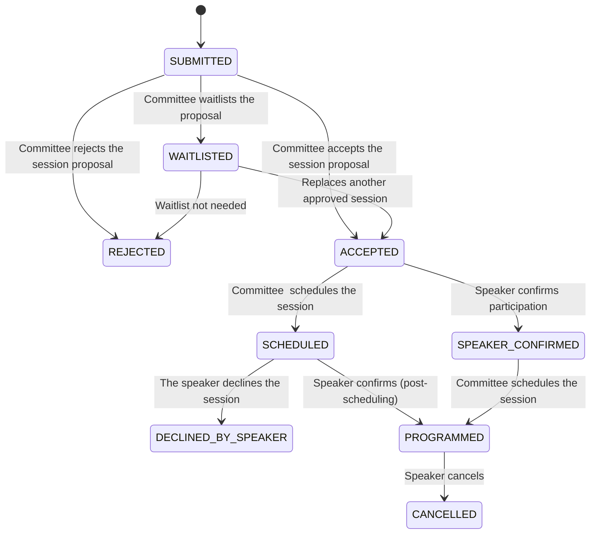

# Conference Manager

This project contains:
- A Firebase backend (Cloud Functions, Firestore, Auth)
- An Angular frontend (in the `frontend` folder), hosted on Firebase Hosting

## Local development

### Backend (Cloud Functions)
1. Install dependencies:
   ```sh
   cd functions
   npm install
   ```
2. To emulate locally:
   ```sh
   firebase emulators:start
   ```

### Frontend (Angular)
1. Install dependencies:
   ```sh
   cd frontend
   npm install
   ```
2. Start the dev server:
   ```sh
   ng serve
   ```

## Deployment

1. Build the frontend:
   ```sh
   cd frontend
   ng build --configuration production
   ```
2. Deploy to Firebase:
   ```sh
   firebase deploy
   ```

## Hosting access

- [https://conference-manager-007.web.app](https://conference-manager-007.web.app)

---

For advanced configuration, see the Firebase and Angular documentation.


## Pages
### Home
- **Home:** The home page of the application
### Person
- **Register:** Application user can register an account (authentication with firebase, link the account to a Person in firestore).
- **Login:** Login page for users having an account.
- **Reset password:** Reset the password of a user. If the person exists, then links it.
- **People List (Admin):** Admin view to list and manage all persons.
- **Edit Person:** Edit person information.
- **View Person:** View person information.

### Conference
- **Conference List:** List of all available conferences.
- **Conference Home:** Landing page for a specific conference.

### Conference Configuration
- **General Configuration:** Edit conference name, dates, days, administrators, location, logo, and description.
- **ConferenceHall Configuration:** Manage ConferenceHall platform access (URL, ID, token).
- **Voxxrin Configuration:** Configure Voxxrin integration (sandbox/prod URLs and tokens).
- **Tracks Configuration:** Manage tracks (name, description, color).
- **Session Types Configuration:** Manage session types for the conference.
- **Planning Structure Configuration:** Configure the planning structure for the conference.

### Planning
- **Planning Screen:** Main planning and scheduling interface.
- **Planning Visualization:** View the schedule with filters (by day, mode: session/language/speaker).

### Speaker
- **Speakers List:** List of all speakers.
- **Edit Speaker Popup:** Edit speaker details in a popup dialog.

### Session
- **My Sessions:** User's personal session list.
- **Conference Sessions List:** List of all sessions for a conference, filterable by session type.
- **Import/Update from ConferenceHall:** Import or update sessions from ConferenceHall.
- **Edit Session Popup:** Edit session details in a popup dialog.
- **View Session Popup:** View session details in a popup dialog.

### Activities (Speaker Dinner, Unconference, etc.)
- **Activity List:** List of all activities.
- **Edit Activity:** Edit activity details.
- **View Activity:** View activity details.
- **Activity Registration Management:** Manage registrations for activities.

### Sponsor
- **Edit Sponsor Popup:** Edit sponsor details in a popup dialog.

## model

### Session status diagram:


