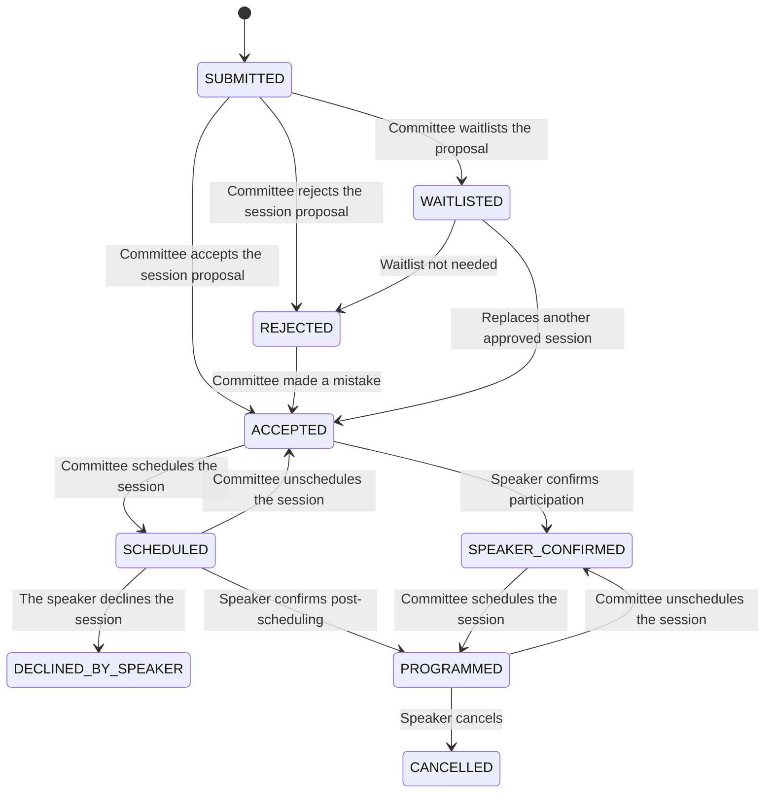

# Persistent Data Model

This document describes the persistent business data stored in Firestore.

## Persistence Scope

Main collections:
- `platform-config`
- `slot-type`
- `conference`
- `conference-hall-config`
- `voxxrin-config`
- `conferenceSecret`
- `person`
- `person_emails` (technical uniqueness index)
- `session`
- `conference-speaker`
- `session-allocation`
- `activity`
- `activityParticipation`
- `conference-dashboard` (+ `history` subcollection)

Embedded entities (stored inside `conference`): `Track`, `Room`, `SessionType`, `Day`, `Slot`, `SponsorType`, `Sponsor`.

## ER Diagram (ID-based Relations)

```mermaid
erDiagram
    PLATFORM_CONFIG {
        string id PK
        boolean onlyPlatformAdminCanCreateConference
        string lastUpdated
    }

    SLOT_TYPE {
        string id PK
        map name
        boolean isSession
        string lastUpdated
    }

    CONFERENCE {
        string id PK
        string name
        number edition
        string[] organizerEmails
        Day[] days
        Track[] tracks
        Room[] rooms
        SessionType[] sessionTypes
        string lastUpdated
    }

    TRACK {
        string conferenceId PK
        string id PK
        string name
    }

    ROOM {
        string conferenceId PK
        string id PK
        string name
        number capacity
    }

    SESSION_TYPE {
        string conferenceId PK
        string id PK
        string name
        number duration
    }

    DAY {
        string conferenceId PK
        string id PK
        string date
    }

    SLOT {
        string conferenceId PK
        string dayId PK
        string id PK
        string roomId FK
        string slotTypeId FK
        string sessionTypeId FK
    }

    CONFERENCE_HALL_CONFIG {
        string id PK
        string conferenceId FK
        string conferenceName
        SessionTypeMapping[] sessionTypeMappings
        string lastCommunication
    }

    VOXXRIN_CONFIG {
        string id PK
        string conferenceId FK
        string timezone
        string[] keywords
        string lastUpdated
    }

    CONFERENCE_SECRET {
        string id PK
        string conferenceId FK
        string secretName
        string secretValue
        string lastUpdated
    }

    PERSON {
        string id PK
        string email
        boolean hasAccount
        boolean isSpeaker
        string search
        string lastUpdated
    }

    PERSON_EMAILS {
        string id PK
        string personId FK
        string email
        timestamp createdAt
    }

    SESSION {
        string id PK
        string speaker1Id FK
        string speaker2Id FK
        string speaker3Id FK
        string conferenceId FK
        string conference_sessionTypeId FK
        string conference_trackId FK
        string conference_status
        string lastUpdated
    }

    CONFERENCE_SPEAKER {
        string id PK
        string conferenceId FK
        string personId FK
        string[] sessionIds FK
        string[] unavailableSlotsId FK
        string source
        string sourceId
        string lastUpdated
    }

    SESSION_ALLOCATION {
        string id PK
        string conferenceId FK
        string dayId FK
        string slotId FK
        string roomId FK
        string sessionId FK
        string lastUpdated
    }

    ACTIVITY {
        string id PK
        string conferenceId FK
        string slotId FK
        string name
        string start
        string end
        string lastUpdated
    }

    ACTIVITY_PARTICIPATION {
        string id PK
        string conferenceId FK
        string activityId FK
        string personId FK
        string participantType
        string lastUpdated
    }

    CONFERENCE_DASHBOARD {
        string id PK
        string conferenceId FK
        number schemaVersion
        string trigger
        string computedAt
        string lastUpdated
    }

    CONFERENCE_DASHBOARD_HISTORY {
        string id PK
        string conferenceDashboardId FK
        string computedAt
    }

    CONFERENCE ||--o{ TRACK : "tracks[].id"
    CONFERENCE ||--o{ ROOM : "rooms[].id"
    CONFERENCE ||--o{ SESSION_TYPE : "sessionTypes[].id"
    CONFERENCE ||--o{ DAY : "days[].id"
    DAY ||--o{ SLOT : "slots[].id"

    SLOT_TYPE ||--o{ SLOT : "slotTypeId"
    ROOM ||--o{ SLOT : "roomId"
    SESSION_TYPE ||--o{ SLOT : "sessionTypeId"

    CONFERENCE ||--o{ CONFERENCE_HALL_CONFIG : "conferenceId"
    CONFERENCE ||--o{ VOXXRIN_CONFIG : "conferenceId"
    CONFERENCE ||--o{ CONFERENCE_SECRET : "conferenceId"
    CONFERENCE ||--o{ SESSION : "conference.conferenceId"
    CONFERENCE ||--o{ CONFERENCE_SPEAKER : "conferenceId"
    CONFERENCE ||--o{ SESSION_ALLOCATION : "conferenceId"
    CONFERENCE ||--o{ ACTIVITY : "conferenceId"
    CONFERENCE ||--o{ ACTIVITY_PARTICIPATION : "conferenceId"
    CONFERENCE ||--|| CONFERENCE_DASHBOARD : "conferenceId / doc id"

    PERSON ||--|| PERSON_EMAILS : "person_emails.personId"
    PERSON ||--o{ SESSION : "speaker1Id / speaker2Id / speaker3Id"
    PERSON ||--o{ CONFERENCE_SPEAKER : "personId"
    PERSON ||--o{ ACTIVITY_PARTICIPATION : "personId"

    SESSION_TYPE ||--o{ SESSION : "conference.sessionTypeId"
    TRACK ||--o{ SESSION : "conference.trackId"

    SESSION ||--o{ SESSION_ALLOCATION : "sessionId"
    SLOT ||--o{ SESSION_ALLOCATION : "slotId (+ dayId, roomId)"

    ACTIVITY ||--o{ ACTIVITY_PARTICIPATION : "activityId"

    CONFERENCE_DASHBOARD ||--o{ CONFERENCE_DASHBOARD_HISTORY : "subcollection history"
```

## Business Objects

### PlatformConfig (`platform-config`)
Global platform settings. Currently used to control whether conference creation is restricted to platform admins.

### SlotType (`slot-type`)
Global catalog of slot semantics (for example, talk slot vs break slot). Conference slots reference it through `slotTypeId`.

### Conference (`conference`)
Root aggregate for event setup and planning. It contains embedded lists for tracks, rooms, session types, planning days and slots, sponsorship setup, and organizer identities.

### ConferenceHallConfig (`conference-hall-config`)
Per-conference integration settings for Conference Hall import, including `sessionTypeMappings` and `lastCommunication`.

### VoxxrinConfig (`voxxrin-config`)
Per-conference publication settings used to generate/export Voxxrin-compatible event data. It complements conference/session/allocation data and should not duplicate them.

### ConferenceSecret (`conferenceSecret`)
Per-conference secret store (token-like values), keyed by `secretName` and linked by `conferenceId`.

### Person (`person`)
Represents a user/speaker identity. Contains account flags, speaker profile details, and search/index fields.

### PersonEmailIndex (`person_emails`)
Technical uniqueness index for normalized email addresses. Document ID is lowercase email; payload links to `personId`.

### Session (`session`)
Talk proposal/session entity. It references up to three speakers (`speaker1Id..speaker3Id`) and carries conference-specific projection under `conference` (`conferenceId`, status, `sessionTypeId`, `trackId`, review data, etc.).

### ConferenceSpeaker (`conference-speaker`)
Conference-scoped speaker projection. Links one `personId` to one `conferenceId`, tracks accepted session IDs, and stores unavailable slot IDs.

### SessionAllocation (`session-allocation`)
Scheduling assignment tuple: `conferenceId + dayId + slotId + roomId + sessionId`.

### Activity (`activity`)
Non-session conference activities (social events, dinners, etc.) with optional `slotId` linkage and participant constraints.

### ActivityParticipation (`activityParticipation`)
Registration record linking one person to one activity in one conference, with captured participant type and attribute values.

### ConferenceDashboard (`conference-dashboard`)
Materialized conference KPIs (submitted/confirmed/allocated counts, speaker ratios, slot occupancy, import freshness, schedule timing).
- Latest snapshot is stored as doc ID = `conferenceId`.
- Time-series snapshots are persisted in subcollection `conference-dashboard/{conferenceId}/history/{computedAt}`.

## Session Status Lifecycle

