# Web Pages Documentation

This document describes the application pages, their navigation links, and their functional purpose.

## Pages and Navigation Diagram

```mermaid
flowchart TD
  HOME["/ (Home)"]
  LOGIN["/login"]
  SIGNUP["/signup"]
  PREF["/preference"]

  CONF_VIEW["/conference/:conferenceId"]
  CONF_CREATE["/conference/create"]
  CONF_MANAGE["/conference/:conferenceId/manage"]

  CFG_GEN["/conference/:conferenceId/config/general"]
  CFG_TYPES["/conference/:conferenceId/config/session-types"]
  CFG_TRACKS["/conference/:conferenceId/config/tracks"]
  CFG_ROOMS["/conference/:conferenceId/config/rooms"]
  CFG_PLAN["/conference/:conferenceId/config/planning-structure"]

  SESS_LIST["/conference/:conferenceId/sessions"]
  SESS_CREATE["/conference/:conferenceId/sessions/create"]
  SESS_EDIT["/conference/:conferenceId/sessions/:sessionId/edit"]
  SESS_IMPORT["/conference/:conferenceId/sessions/import"]
  SESS_ALLOC["/conference/:conferenceId/allocation"]

  SPEAK_LIST["/conference/:conferenceId/speakers"]
  SPEAK_CREATE["/conference/:conferenceId/speakers/create"]
  SPEAK_EDIT["/conference/:conferenceId/speakers/:conferenceSpeakerId"]

  ACT_CFG["/conference/:conferenceId/activities"]
  ACT_PART["/conference/:conferenceId/activity-participation"]
  ACT_PART_ONE["/conference/:conferenceId/activities/:activityId/participation"]
  ACT_ADMIN["/conference/:conferenceId/activities/:activityId/admin"]

  SP_CFG["/conference/:conferenceId/sponsors/config"]
  SP_MAN["/conference/:conferenceId/sponsors/manage"]

  PUB["/conference/:conferenceId/publish"]
  PUB_VOX["/conference/:conferenceId/publish/voxxrin-config"]

  ADM_PERSONS["/admin/persons"]
  ADM_PLATFORM["/admin/platform-config"]

  HOME --> LOGIN
  HOME --> SIGNUP
  HOME --> CONF_CREATE
  HOME --> CONF_VIEW
  HOME --> CONF_MANAGE

  LOGIN --> HOME
  SIGNUP --> HOME
  HOME --> PREF

  CONF_VIEW --> CONF_MANAGE
  CONF_VIEW --> ACT_PART_ONE

  CONF_MANAGE --> CFG_GEN
  CONF_MANAGE --> CFG_TYPES
  CONF_MANAGE --> CFG_TRACKS
  CONF_MANAGE --> CFG_ROOMS
  CONF_MANAGE --> CFG_PLAN

  CONF_MANAGE --> SESS_IMPORT
  CONF_MANAGE --> SESS_ALLOC
  CONF_MANAGE --> SESS_LIST
  CONF_MANAGE --> SPEAK_LIST
  CONF_MANAGE --> PUB

  CONF_MANAGE --> ACT_CFG
  CONF_MANAGE --> ACT_PART
  CONF_MANAGE --> ACT_ADMIN

  CONF_MANAGE --> SP_CFG
  CONF_MANAGE --> SP_MAN

  SESS_LIST --> SESS_CREATE
  SESS_LIST --> SESS_EDIT
  SESS_CREATE --> SESS_LIST
  SESS_EDIT --> SESS_LIST

  SPEAK_LIST --> SPEAK_CREATE
  SPEAK_LIST --> SPEAK_EDIT
  SPEAK_CREATE --> SPEAK_LIST
  SPEAK_EDIT --> SPEAK_LIST

  ACT_PART --> ACT_PART_ONE
  ACT_ADMIN --> ACT_PART_ONE

  PUB --> PUB_VOX

  HOME --> ADM_PERSONS
  HOME --> ADM_PLATFORM
```

## Page-by-page Chapters

### 1. Home (`/`)
Purpose:
- Home page with the conference list.
- Main navigation entry point.

Access:
- Public.

Navigation:
- To `/conference/:conferenceId` for non-organizers.
- To `/conference/:conferenceId/manage` if the logged-in user is an organizer.
- To `/conference/create` if the user has conference creation rights.
- To `/login`, `/signup`, `/preference` via the main menu.

### 2. Signup (`/signup`)
Purpose:
- User account creation.

Access:
- Public.

Navigation:
- Redirects to `/` after successful signup.
- Can link to `/login` in the auth flow.

### 3. Login (`/login`)
Purpose:
- User authentication.

Access:
- Public.

Navigation:
- Redirects to target page (or `/`) after successful login.
- Link to `/signup`.

### 4. Preferences (`/preference`)
Purpose:
- User preferences management.

Access:
- Authenticated user.

Navigation:
- Accessible from the profile menu.

### 5. Conference View (`/conference/:conferenceId`)
Purpose:
- Public conference page (information, dates, external links).
- Shows available activities for signed-in users.

Access:
- Public.

Navigation:
- To `/conference/:conferenceId/manage` if user can manage the conference.
- To `/conference/:conferenceId/activities/:activityId/participation` for activity registration.

### 6. Conference Create (`/conference/create`)
Purpose:
- Create a new conference.

Access:
- Authenticated + `ConferenceCreateGuard`.

Navigation:
- After creation, redirects to `/conference/:conferenceId/config/general`.

### 7. Conference Manage (hub) (`/conference/:conferenceId/manage`)
Purpose:
- Organizer management dashboard.
- Central hub for configuration and operations.

Access:
- Authenticated + organizer + valid conference context.

Navigation:
- Links to conference configuration, sessions, speakers, activities, sponsors, and publishing pages.

### 8. Conference Config General (`/conference/:conferenceId/config/general`)
Purpose:
- General conference settings.

Access:
- Authenticated + valid conference context.

Navigation:
- `ConferenceConfig` module tab: `general`.

### 9. Conference Config Session Types (`/conference/:conferenceId/config/session-types`)
Purpose:
- Session type management.

Access:
- Authenticated + valid conference context.

Navigation:
- `ConferenceConfig` module tab: `session-types`.

### 10. Conference Config Tracks (`/conference/:conferenceId/config/tracks`)
Purpose:
- Track management.

Access:
- Authenticated + valid conference context.

Navigation:
- `ConferenceConfig` module tab: `tracks`.

### 11. Conference Config Rooms (`/conference/:conferenceId/config/rooms`)
Purpose:
- Room management.

Access:
- Authenticated + valid conference context.

Navigation:
- `ConferenceConfig` module tab: `rooms`.

### 12. Conference Config Planning Structure (`/conference/:conferenceId/config/planning-structure`)
Purpose:
- Planning structure management (days, slots, constraints).

Access:
- Authenticated + valid conference context.

Navigation:
- `ConferenceConfig` module tab: `planning-structure`.

### 13. Sessions List (`/conference/:conferenceId/sessions`)
Purpose:
- Conference session list.
- Entry point for session creation/editing.

Access:
- Authenticated + organizer + valid conference context.

Navigation:
- To `/conference/:conferenceId/sessions/create`.
- To `/conference/:conferenceId/sessions/:sessionId/edit`.

### 14. Session Create (`/conference/:conferenceId/sessions/create`)
Purpose:
- Session creation form.

Access:
- Authenticated + valid conference context.

Navigation:
- Returns to `/conference/:conferenceId/sessions` after save/cancel.

### 15. Session Edit (`/conference/:conferenceId/sessions/:sessionId/edit`)
Purpose:
- Existing session edit form.

Access:
- Authenticated + valid conference context.

Navigation:
- Returns to `/conference/:conferenceId/sessions` after save/cancel.

### 16. Sessions Import (`/conference/:conferenceId/sessions/import`)
Purpose:
- Conference Hall session import.
- Import settings and execution.

Access:
- Authenticated + organizer + valid conference context.

Navigation:
- Usually opened from Manage.

### 17. Session Allocation (`/conference/:conferenceId/allocation`)
Purpose:
- Session planning/allocation across slots and rooms.

Access:
- Authenticated + organizer + valid conference context.

Navigation:
- Usually opened from Manage.

### 18. Speakers List (`/conference/:conferenceId/speakers`)
Purpose:
- Conference speaker list.

Access:
- Authenticated + organizer + valid conference context.

Navigation:
- To `/conference/:conferenceId/speakers/create`.
- To `/conference/:conferenceId/speakers/:conferenceSpeakerId`.

### 19. Speaker Create (`/conference/:conferenceId/speakers/create`)
Purpose:
- Create a conference speaker entry.

Access:
- Authenticated + organizer + valid conference context.

Navigation:
- Returns to `/conference/:conferenceId/speakers`.

### 20. Speaker Edit (`/conference/:conferenceId/speakers/:conferenceSpeakerId`)
Purpose:
- Edit conference speaker details (availability, linked sessions).

Access:
- Authenticated + organizer + valid conference context.

Navigation:
- Returns to `/conference/:conferenceId/speakers`.

### 21. Activities Config (`/conference/:conferenceId/activities`)
Purpose:
- Activities configuration (create, edit, settings).

Access:
- Authenticated + organizer + valid conference context.

Navigation:
- Opened from Manage.

### 22. Activity Participation (global) (`/conference/:conferenceId/activity-participation`)
Purpose:
- Aggregated participation view across conference activities.

Access:
- Authenticated + valid conference context.

Navigation:
- Can redirect to a specific activity (`.../activities/:activityId/participation`).

### 23. Activity Participation (single) (`/conference/:conferenceId/activities/:activityId/participation`)
Purpose:
- Register/view participation for one activity.

Access:
- Authenticated + valid conference context.

Navigation:
- Reachable from conference public view and activity admin pages.

### 24. Activity Admin (`/conference/:conferenceId/activities/:activityId/admin`)
Purpose:
- Advanced administration for one specific activity.

Access:
- Authenticated + organizer + valid conference context.

Navigation:
- To `.../activities/:activityId/participation` to inspect participation.

### 25. Sponsors Config (`/conference/:conferenceId/sponsors/config`)
Purpose:
- Sponsoring structure configuration (types, booth maps, etc.).

Access:
- Authenticated + organizer + valid conference context.

Navigation:
- Opened from Manage.

### 26. Sponsors Manage (`/conference/:conferenceId/sponsors/manage`)
Purpose:
- Operational sponsor management (assignment, details).

Access:
- Authenticated + organizer + valid conference context.

Navigation:
- Opened from Manage.

### 27. Publish (`/conference/:conferenceId/publish`)
Purpose:
- Publishing hub.
- Voxxrin JSON export.
- Planning PDF exports (all days, per day, per room).

Access:
- Authenticated + organizer + valid conference context.

Navigation:
- To `/conference/:conferenceId/publish/voxxrin-config`.

### 28. Voxxrin Config (`/conference/:conferenceId/publish/voxxrin-config`)
Purpose:
- Detailed Voxxrin publishing configuration.

Access:
- Authenticated + organizer + valid conference context.

Navigation:
- Accessible from Publish page.

### 29. Admin Persons (`/admin/persons`)
Purpose:
- Global person administration.

Access:
- `AdminGuard`.

Navigation:
- Accessible from admin menu.

### 30. Admin Platform Config (`/admin/platform-config`)
Purpose:
- Global platform settings administration.

Access:
- `AdminGuard`.

Navigation:
- Accessible from admin menu.

## Access Notes (guards)

- `AuthGuard`: requires an authenticated user.
- `ConferenceManageContextGuard`: requires a valid conference context.
- `ConferenceOrganizerGuard`: requires organizer rights for the conference.
- `ConferenceCreateGuard`: requires conference creation rights.
- `AdminGuard`: requires platform admin rights.
