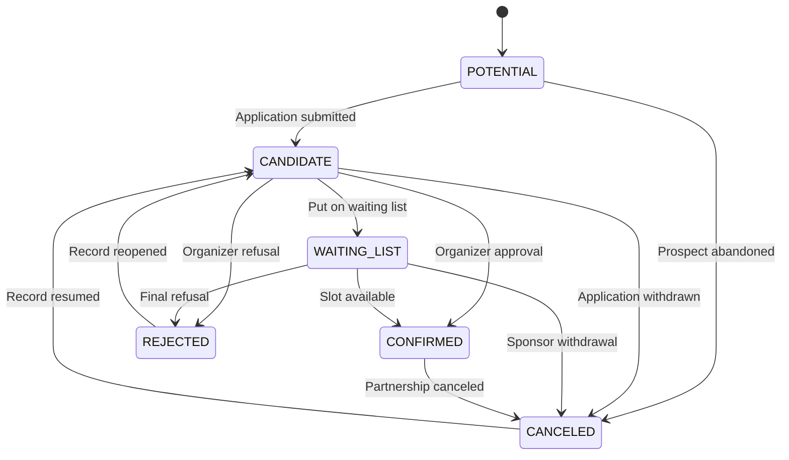
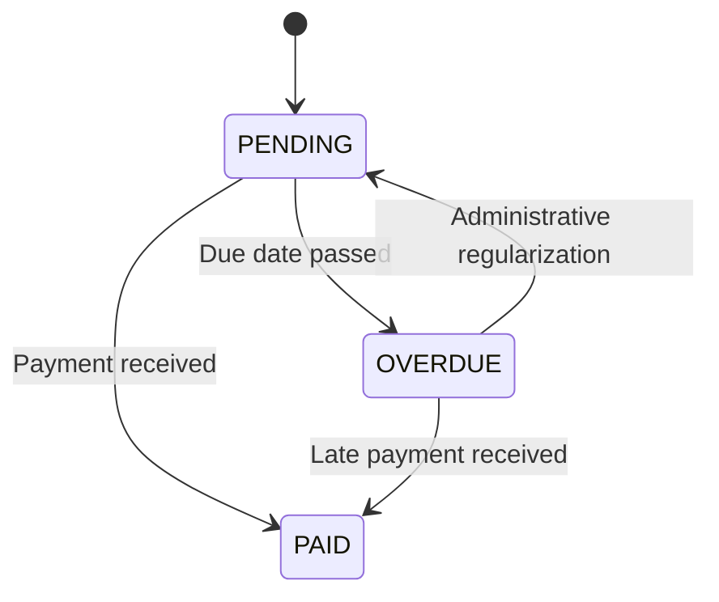

# Sponsor Specification

This document specifies how sponsor management works in the application.

## Scope

Sponsor management covers:

- sponsorship configuration at conference level
- sponsor application
- organizer business validation
- financial follow-up
- logistics follow-up
- business action history
- sponsor ticket allocation

This document does not specify the technical implementation details of Mailjet sending or BilletWeb integration.
It defines the functional rules those integrations must follow.

## Separation of Responsibilities

Sponsor management is based on three distinct data levels:

- `Conference.sponsoring`: sponsorship offer configuration for one conference
- `Sponsor`: one sponsor record for one conference
- `Sponsor.businessEvents`: business history of significant sponsor actions

The following rules are mandatory:

- `Conference.sponsoring` never contains the sponsors themselves
- each sponsor is stored as a separate persistent entity
- each sponsor is linked to one conference through `conferenceId`
- each sponsor references one sponsorship offer through `sponsorTypeId`

## Sponsorship Configuration

Conference sponsorship configuration is stored in `Conference.sponsoring`.

It contains:

- `sponsorTypes`
- `sponsorBoothMaps`
- `startDate`
- `endDate`
- `counter`
- optional communication CC email
- optional bank details for wire transfer

### `sponsorTypes`

Each `SponsorType` defines one sponsorship offer available for the conference.

It contains at least:

- an identifier
- a name
- a localized description
- a maximum number of sponsors
- a price
- a display color
- a text color
- a booth allocation mode
- a list of available booth names
- a list of conference ticket quotas

`SponsorType.boothAllocationMode` defines how booths are assigned for that sponsorship offer.

Allowed values are:

- `MANUAL`: organizer assigns the booth explicitly
- `RANDOM`: booth is assigned automatically without considering wishes
- `REGISTRATION_DATE`: automatic allocation based on sponsor registration date and wishes
- `WISHES_DATE`: automatic allocation based on last wishes update date and wishes
- `CONFIRMATION_DATE`: automatic allocation based on confirmation date and wishes
- `PAYMENT_DATE`: automatic allocation based on payment date and wishes

Rules:

- if no explicit value is configured, the default booth allocation mode is `MANUAL`

### Sponsorship Period

The sponsorship period is defined by:

- `Conference.sponsoring.startDate`
- `Conference.sponsoring.endDate`

Rules:

- outside this period, sponsor users cannot create or update a sponsorship application
- organizers can still view and manage sponsors outside the period

## `Sponsor` Entity

A `Sponsor` represents one sponsor record linked to one conference.

It contains:

- sponsor identity
- business status
- financial status
- presentation information
- sponsorship type
- booth information
- sponsor administrators
- conference tickets
- business history
- optional summary projections

## Sponsor Business Lifecycle

The sponsor business lifecycle is carried by `Sponsor.status`.

Allowed values are:

- `POTENTIAL`
- `CANDIDATE`
- `WAITING_LIST`
- `CONFIRMED`
- `REJECTED`
- `CANCELED`

### Status Definitions

- `POTENTIAL`: sponsor identified by organizers, with no finalized application yet
- `CANDIDATE`: application submitted or under review
- `WAITING_LIST`: valid application waiting for availability or final decision
- `CONFIRMED`: sponsor approved by the organization
- `REJECTED`: application refused
- `CANCELED`: record abandoned or partnership canceled

### Initial State

Creation rules are:

- a sponsor created by an organizer starts in `POTENTIAL`, unless explicitly set otherwise
- a sponsor created from the sponsor application form starts in `CANDIDATE`

### Allowed Transitions

Allowed transitions are the following:



### Status Rules

- `statusDate` must be updated on every `status` change
- `CONFIRMED` does not depend on payment
- `REJECTED` and `CANCELED` are closed states, but explicit reopening remains allowed
- a sponsor in `REJECTED` or `CANCELED` must not be published as an active sponsor

## Financial Follow-up

Financial follow-up is carried by `Sponsor.paymentStatus`.

Allowed values are:

- `PENDING`
- `PAID`
- `OVERDUE`

### Payment Status Definitions

- `PENDING`: payment expected or not yet recorded
- `PAID`: payment received
- `OVERDUE`: payment not received after the due date

### Allowed Transitions



### Payment Rules

- `paymentStatusDate` must be updated on every `paymentStatus` change
- payment does not automatically modify `Sponsor.status`
- a sponsor can be `CONFIRMED` with `paymentStatus = PENDING`

## Booth Information

The sponsor contains:

- `boothName`: assigned booth
- `boothWishes`: booth preferences
- `boothWishesDate`: booth preference update date
- `communicationLanguage`: preferred communication language (`fr` or `en`)
- `purchaseOrder`: optional sponsor-side PO reference
- `acceptedNumber`: immutable number assigned on first confirmation

Rules:

- `boothWishes` must contain only booth names compatible with `sponsorTypeId`
- `boothWishesDate` must be updated when preferences change
- `boothName` is set only when the organization actually assigns a booth
- `communicationLanguage` is chosen by the sponsor from the registration/configuration page
- all sponsor emails and generated attachments use `communicationLanguage`
- `purchaseOrder` is optional and can be updated by the sponsor
- `acceptedNumber` is assigned only on the first transition to `CONFIRMED`
- once assigned, `acceptedNumber` is immutable and cannot be reused for another sponsor

### Automatic Booth Allocation

Organizers can trigger booth auto-allocation from the sponsor management page for each sponsor type whose
`SponsorType.boothAllocationMode` is not `MANUAL`.

Rules:

- auto-allocation only processes sponsors with `status = CONFIRMED`
- auto-allocation only processes sponsors whose `sponsorTypeId` matches the selected sponsor type
- each run starts by clearing any existing `boothName` on the processed sponsors before recomputing the result
- `RANDOM` allocates compatible booths randomly and ignores `boothWishes`
- `REGISTRATION_DATE`, `WISHES_DATE`, `CONFIRMATION_DATE`, and `PAYMENT_DATE` first sort sponsors by the corresponding date
- after sorting, the algorithm scans each sponsor and assigns the first wished booth that is still free
- if none of a sponsor's wished booths is available, the sponsor remains without booth allocation
- the organizer UI must report the sponsors that remain without booth allocation after the run

## Acceptance Numbering

When a sponsor is first moved to `CONFIRMED`, the application must:

1. read `Conference.sponsoring.counter`
2. increment it atomically
3. assign the new value to `Sponsor.acceptedNumber`
4. persist the incremented counter back to `Conference.sponsoring.counter`

Rules:

- numbering happens only on the first transition to `CONFIRMED`
- reopening or canceling a sponsor does not change the assigned number
- document numbering uses `<edition>-<acceptedNumber>` with the sponsor number left-padded to 2 digits

## Sponsor Administrators

The sponsor contains an `adminEmails` list.

Rules:

- this list identifies the users allowed to manage the sponsor application
- one sponsor can have multiple administrators
- sponsor lookup for sponsor users relies on `conferenceId` and `adminEmails`

## Sponsor Tickets

Sponsor tickets are stored in `Sponsor.conferenceTickets`.

Each ticket contains:

- `conferenceTicketTypeId`
- `email`
- `ticketId`
- `status`

Allowed values for `ConferenceTicket.status` are:

- `REQUESTED`
- `CREATED`
- `SENT`
- `CANCELED`

Rules:

- available tickets must respect the quotas defined in the `SponsorType`
- a canceled ticket keeps its business history
- BilletWeb integration must respect this business state

## Business History

Sponsor business history is stored in `Sponsor.businessEvents`.

It is not an exhaustive technical log.
It is a functional history of significant business actions.

### Role of `businessEvents`

`businessEvents` is used to track:

- document sends
- reminders
- logistics assignments
- ticket allocations
- more generally, notable business actions on the sponsor

These events are not statuses.
They do not replace `status` or `paymentStatus`.

### Event Types

The initially retained business event types are:

- `ORDER_FORM_SENT`
- `INVOICE_SENT`
- `INVOICE_PAID_SENT`
- `PAYMENT_REMINDER_SENT`
- `BOOTH_ASSIGNED`
- `BOOTH_CHANGED`
- `TICKETS_ALLOCATED`

### Event Structure

Each event follows this structure:

```ts
interface SponsorBusinessEvent {
  type:
    | 'ORDER_FORM_SENT'
    | 'INVOICE_SENT'
    | 'INVOICE_PAID_SENT'
    | 'PAYMENT_REMINDER_SENT'
    | 'BOOTH_ASSIGNED'
    | 'BOOTH_CHANGED'
    | 'TICKETS_ALLOCATED';
  at: string;
  by: string;
  metadata?: Record<string, string | number | boolean>;
}
```

### Write Rules

For any significant business action concerning a sponsor, the application must:

1. execute the business action
2. add an event to `Sponsor.businessEvents`
3. update derived fields when needed

Examples:

- sending an invoice -> add `INVOICE_SENT`
- sending a paid invoice -> add `INVOICE_PAID_SENT`
- sending an order form -> add `ORDER_FORM_SENT`
- assigning a booth -> add `BOOTH_ASSIGNED`
- allocating tickets -> add `TICKETS_ALLOCATED`

## Summary Projections

The sponsor can contain summary projections derived from `businessEvents`.

These projections are used only to simplify:

- display
- filtering
- simple business rules

Typical back-office usage includes filtering sponsors by `paymentStatus` and showing document badges when
`documents.orderFormSentAt`, `documents.invoiceSentAt`, or `documents.invoicePaidSentAt` are present.

The initially retained projections are:

```ts
documents?: {
  orderFormSentAt?: string;
  invoiceSentAt?: string;
  invoicePaidSentAt?: string;
  lastReminderSentAt?: string;
};

logistics?: {
  boothAssignedAt?: string;
  ticketsAllocatedAt?: string;
};
```

Rules:

- `businessEvents` remains the functional source of truth
- `documents` and `logistics` are derived fields
- when a projection exists, it must remain consistent with history

## Document and Notification Rules

Document and administrative notification sends are triggered by explicit organizer actions.

Rules:

- sending a document must not be triggered implicitly by a simple status change
- after a successful send, the corresponding business event must be added
- history must make it possible to know which document was sent and when

Examples:

- action "send order form" -> event `ORDER_FORM_SENT`
- action "send invoice" -> event `INVOICE_SENT`
- action "send paid invoice" -> event `INVOICE_PAID_SENT`
- action "send reminder" -> event `PAYMENT_REMINDER_SENT`

## Sponsor Emails

Sponsor emails are transactional emails sent from explicit actions.

They are used either to notify the sponsor or to send an administrative document.

General rules:

- sponsor emails are sent according to the general specification in `doc/mailjet.md`
- the business rules below define when a sponsor email exists and which document it carries
- a successful sponsor email must produce the corresponding business event in `Sponsor.businessEvents`
- if `Conference.sponsoring.ccEmail` is configured, every sponsor email includes this address in CC
- the language of the email and any generated attachment is taken from `Sponsor.communicationLanguage`

## Sponsor Email Types

The initially retained sponsor email types are:

- application confirmation
- order form
- invoice
- paid invoice
- payment reminder
- administrative summary

## Application Confirmation

Application confirmation is an informational email sent after a sponsor record is submitted or significantly updated, if the organization chooses to notify the sponsor.

Rules:

- this email does not require an attachment
- it must mention at least the conference, the sponsor, and the requested sponsorship type
- it can be sent after the initial creation of a sponsor in `CANDIDATE`

Attachment:

- no mandatory attachment

History:

- no dedicated `SponsorBusinessEvent` type is required at this stage for this email

## Order Form Email

The order form email is used to send the sponsor a contractual or administratively actionable document.

Rules:

- it is triggered by the explicit action "send order form"
- it is reserved for a context where billing data is sufficiently stabilized

Attachment:

- order form PDF

Content rules:

- if `Sponsor.purchaseOrder` is present, it must appear in the order form
- if `Conference.sponsoring.bankDetails` is configured, the order form must show IBAN/BIC at the bottom

History:

- adds the `ORDER_FORM_SENT` event
- updates `documents.orderFormSentAt` if this projection is enabled

## Invoice Email

The invoice email is used to send a sponsor invoice.

Rules:

- it is triggered by the explicit action "send invoice"
- it must not be sent implicitly from a simple status change
- it must follow document idempotence rules

Attachment:

- invoice PDF

Content rules:

- if `Sponsor.purchaseOrder` is present, it must appear in the invoice

History:

- adds the `INVOICE_SENT` event
- updates `documents.invoiceSentAt` if this projection is enabled

## Paid Invoice Email

The paid invoice email is used to send a sponsor an acquitted invoice once payment is confirmed.

Rules:

- it is triggered by the explicit action "send paid invoice"
- it is only available when `paymentStatus = PAID`
- it must not be sent implicitly from a simple status change
- it must follow document idempotence rules

Attachment:

- paid invoice PDF

Content rules:

- it is generated from the invoice template
- if `Sponsor.purchaseOrder` is present, it must appear in the paid invoice

History:

- adds the `INVOICE_PAID_SENT` event
- updates `documents.invoicePaidSentAt` if this projection is enabled

## Payment Reminder Email

The payment reminder email is used to remind a sponsor about an expected or overdue payment.

Rules:

- it is triggered by the explicit action "send reminder"
- it is typically used when `paymentStatus` is `PENDING` or `OVERDUE`

Attachment:

- no mandatory attachment
- an invoice or summary can be attached if the organization chooses to do so

History:

- adds the `PAYMENT_REMINDER_SENT` event
- updates `documents.lastReminderSentAt` if this projection is enabled

## Administrative Summary Email

The administrative summary email is used to send the sponsor a summary of practical information.

It can include for example:

- confirmed sponsorship type
- assigned booth
- allocated conference tickets
- next administrative steps

Attachment:

- no mandatory attachment
- a summary PDF can be attached if needed

History:

- no dedicated `SponsorBusinessEvent` type is required at this stage for this email

## Mapping Table

The following table defines the reference sponsor emails:

| Sponsor email | Trigger | Attachment | Business event |
| --- | --- | --- | --- |
| Application confirmation | Explicit application notification action | None required | None required |
| Order form | "send order form" action | Order form PDF | `ORDER_FORM_SENT` |
| Invoice | "send invoice" action | Invoice PDF | `INVOICE_SENT` |
| Paid invoice | "send paid invoice" action | Paid invoice PDF | `INVOICE_PAID_SENT` |
| Payment reminder | "send reminder" action | None required | `PAYMENT_REMINDER_SENT` |
| Administrative summary | Explicit administrative notification action | None required | None required |

## Attachment Rules

The following rules apply to sponsor attachments:

- official documents are sent as PDFs
- PDFs are generated on the backend
- attachments are linked to an explicit transactional email
- attachments must remain consistent with sponsor data at send time

The officially retained attachments at this stage are:

- order form PDF
- invoice PDF
- paid invoice PDF

## Sponsor Self-service Document Download

Sponsors can download again the official documents that were already sent to them.

Rules:

- download is available from the sponsor self-service configuration page
- authorization is based on `Sponsor.adminEmails`
- documents are regenerated on demand from current data
- generated files are not stored
- regeneration uses the current `Sponsor.communicationLanguage`
- only documents already sent before are available for download

Available sponsor self-service downloads include:

- order form PDF after `documents.orderFormSentAt`
- invoice PDF after `documents.invoiceSentAt`
- paid invoice PDF after `documents.invoicePaidSentAt`

## Email and Sponsor Consistency Rules

The following rules are mandatory:

- a sponsor email must not by itself create an implicit `Sponsor.status` change
- a successful sponsor email must enrich business history only if a corresponding event is defined
- `documents.*` projections must be updated only after an actual successful send
- a failed send must not produce a fake `*_SENT` event

## Business Visibility Rules

For publication or business usage:

- only sponsors in `CONFIRMED` are considered active sponsors
- sponsors in `CANDIDATE` and `WAITING_LIST` remain internal records
- sponsors in `REJECTED` and `CANCELED` remain available for history and audit

## Consistency Rules

The following rules are mandatory:

- `conferenceId` must point to an existing conference
- `sponsorTypeId` must match a `SponsorType` of the conference
- booth preferences must be compatible with the `SponsorType`
- `status` and `paymentStatus` changes must update their respective dates
- significant business actions must be tracked in `businessEvents`
- `documents` and `logistics` projections, when present, must remain consistent with history

## Summary of Behavior

The target behavior is the following:

1. the conference defines its sponsorship offers in `Conference.sponsoring`
2. a sponsor creates or updates a `Sponsor` record
3. organizers manage the lifecycle through `Sponsor.status`
4. organizers follow financial progress through `Sponsor.paymentStatus`
5. organizers assign booths, documents, and tickets through explicit actions
6. each important business action feeds `Sponsor.businessEvents`
7. summary fields can be maintained to simplify back-office screens
